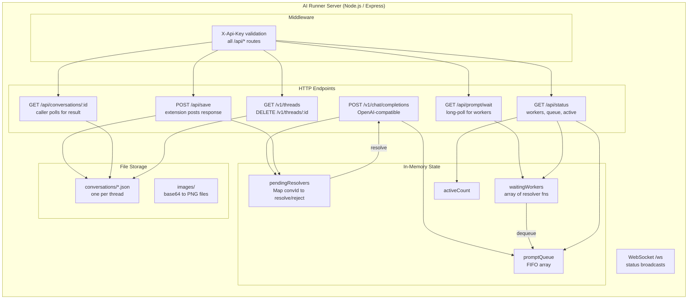
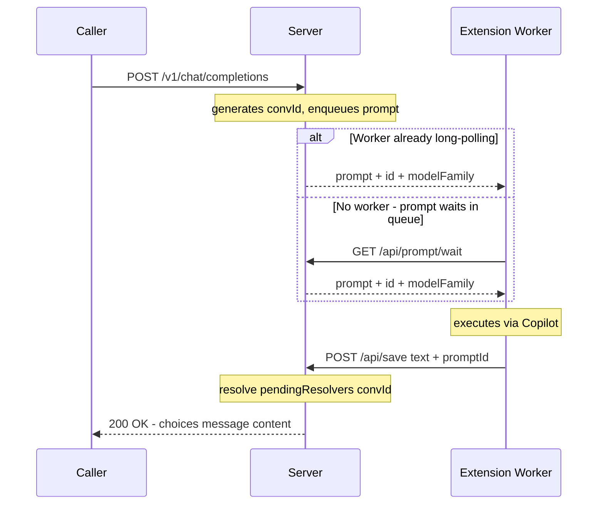
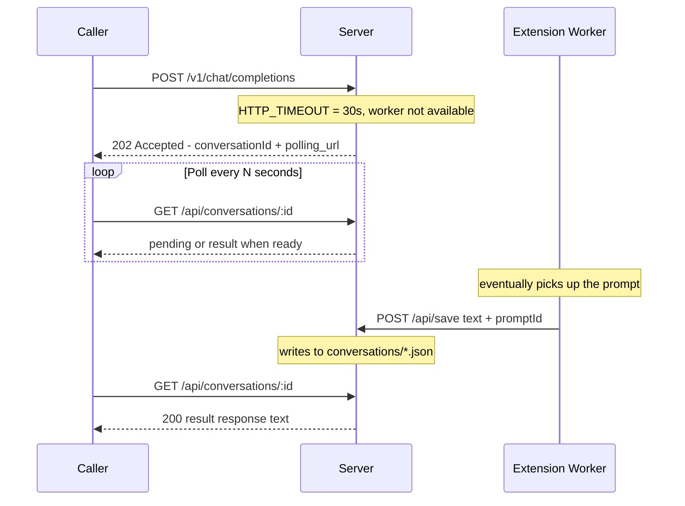
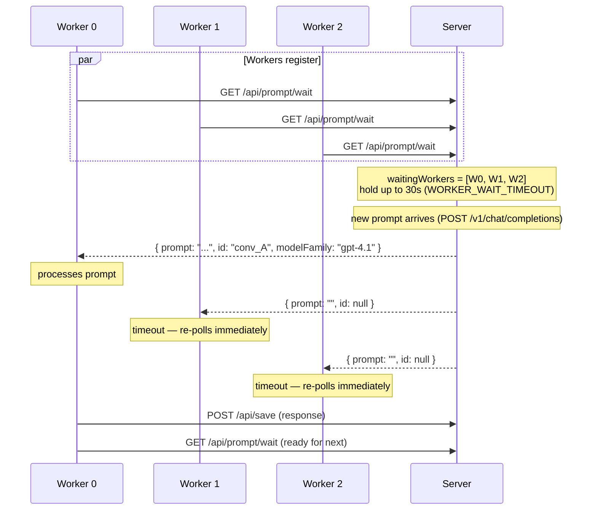
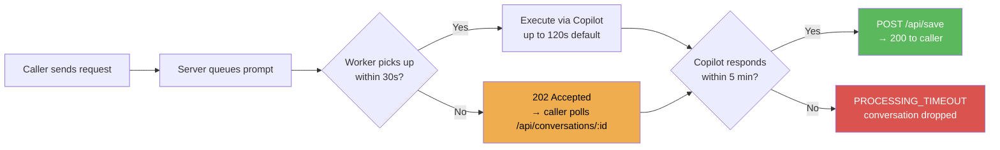

# AI Runner Server — Architecture Diagrams

## 1. Server Internal Structure

---

## 2. Request Lifecycle — Happy Path (< 30s)

---

## 3. Request Lifecycle — Slow Path (> 30s)

---

## 4. Long-Poll Mechanics

---

## 5. Timeout Hierarchy

