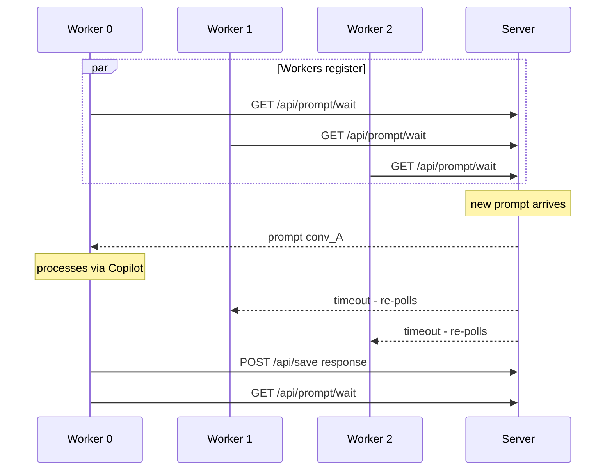
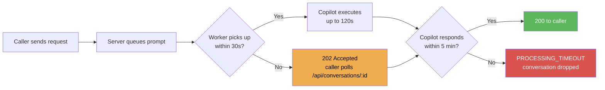

# AI Runner Server

Middleware server that connects any application (via OpenAI-compatible API) with GitHub Copilot running in VS Code. Supports N simultaneous parallel conversations.

```
Your App / Laravel / Postman
        |  POST /v1/chat/completions
        v
   AI Runner Server  ─────────────────────>  VS Code Extension
   (Node.js / Docker)    long-poll              (GitHub Copilot)
        ^                                             |
        └─────────────────────────────────────────────┘
              POST /api/save (response)
```

---

## Requirements

| Option | Requirements |
|--------|-------------|
| **Docker** (recommended) | Docker + Docker Compose |
| **Manual** | Node.js 18+ |

> The VS Code extension must be installed and running — it is what executes prompts via Copilot.

---

## Option A — Docker (recommended)

### 1. Clone the repository

```bash
git clone https://github.com/lordmacu/aiextension-server.git
cd aiextension-server
```

### 2. Configure environment variables (optional)

```bash
cp .env.example .env
# Edit .env if you want to change the port or API key
```

| Variable | Default | Description |
|----------|---------|-------------|
| `PORT` | `54321` | Server port |
| `AI_API_KEY` | `YOUR_KEY` | API key to authenticate requests |

### 3. Start

```bash
docker compose up -d
```

The server will be available at `http://localhost:54321`.

### Useful Docker commands

```bash
docker compose up -d          # Start in background
docker compose down           # Stop
docker compose logs -f        # Tail logs in real time
docker compose restart        # Restart
docker compose pull && docker compose up -d  # Update image
```

### Verify it's working

```bash
curl http://localhost:54321/v1/health
# -> {"status":"ok","active":0,"queued":0,"workers":0}
```

---

## Option B — Manual (without Docker)

### 1. Clone and install dependencies

```bash
git clone https://github.com/lordmacu/aiextension-server.git
cd aiextension-server
npm install
```

### 2. Start

```bash
# Development
node server.js

# Production with PM2 (recommended)
npm install -g pm2
pm2 start server.js --name aiextension-server
pm2 save
pm2 startup   # copy and run the command it prints
```

### 3. Verify

```bash
curl http://localhost:54321/v1/health
```

---

## Linux Server with Apache (production)

### 1. Install Node.js and PM2

```bash
# Ubuntu/Debian
curl -fsSL https://deb.nodesource.com/setup_20.x | sudo bash -
sudo apt-get install -y nodejs
sudo npm install -g pm2
```

### 2. Clone and configure

```bash
cd /home/bitnami   # or your home directory
git clone https://github.com/lordmacu/aiextension-server.git aiextension
cd aiextension
npm install
```

### 3. Start with PM2

```bash
pm2 start server.js --name aiextension-server
pm2 save
pm2 startup   # run the command it generates
```

### 4. Apache reverse proxy

Enable modules (once):

```bash
sudo a2enmod proxy proxy_http proxy_wstunnel rewrite
sudo systemctl restart apache2
```

Add to your VirtualHost (`/etc/apache2/sites-available/your-site.conf`):

```apache
<VirtualHost *:443>
    ServerName your-domain.com
    # ... your existing SSL config ...

    # Proxy to AI server at /ai/ path
    # IMPORTANT: trailing slash on both sides is required
    ProxyPass        /ai/ http://127.0.0.1:54321/
    ProxyPassReverse /ai/ http://127.0.0.1:54321/

    # WebSocket (for real-time updates in the extension)
    RewriteEngine On
    RewriteCond %{HTTP:Upgrade} websocket [NC]
    RewriteCond %{HTTP:Connection} upgrade [NC]
    RewriteRule ^/ai/ws$ ws://127.0.0.1:54321/ws [P,L]
</VirtualHost>
```

```bash
sudo systemctl restart apache2
```

The server will be available at `https://your-domain.com/ai/`.

### 5. Configure the VS Code extension

In VS Code → Settings → search `aiRunner`:

| Setting | Value |
|---------|-------|
| `aiRunner.serverUrl` | `https://your-domain.com/ai` |
| `aiRunner.apiKey` | `YOUR_KEY` (or your key) |

---

## VS Code Extension

The extension executes prompts via GitHub Copilot. Without it the server receives requests but cannot process them.

**Repository: [vscode-ai-extension →](https://github.com/lordmacu/vscode-ai-extension)**

### Install the extension

```bash
git clone https://github.com/lordmacu/vscode-ai-extension.git
cd vscode-ai-extension
bash install.sh
```

Reload VS Code (`Cmd+Shift+P` → Reload Window) and click **Start** in the AI Runner panel.

### Verify connection

With the extension active, the server should show connected workers:

```bash
curl -H "X-Api-Key: YOUR_KEY" http://localhost:54321/api/status
# -> {"active":0,"queued":0,"workers":3,"wsClients":1,"pendingResolvers":0}
#                                              ^
#                                              3 workers ready
```

---

## API Usage

### Main endpoint — OpenAI-compatible

```
POST /v1/chat/completions
X-Api-Key: YOUR_KEY
Content-Type: application/json
```

```json
{
  "model": "gpt-4.1",
  "messages": [
    { "role": "system", "content": "You are an expert assistant." },
    { "role": "user",   "content": "What is 2 + 2?" }
  ],
  "stream": false,
  "thread_id": "my-conversation-123"
}
```

### Response behavior

| Scenario | HTTP | Body |
|----------|------|------|
| Extension active, prompt processed in < 30s | `200` | `{ choices[0].message.content }` |
| No extension available within 30s | `202` | `{ accepted, conversationId, polling_url }` |
| Processing error | `500` | `{ error: "..." }` |

When you receive `202`, the prompt remains queued (up to 5 minutes). Poll `GET /api/conversations/:conversationId` to get the result once the extension processes it.

Successful response:

```json
{
  "id": "chatcmpl-1234567890",
  "object": "chat.completion",
  "model": "gpt-4.1",
  "thread_id": "my-conversation-123",
  "choices": [{
    "index": 0,
    "message": { "role": "assistant", "content": "2 + 2 = 4" },
    "finish_reason": "stop"
  }],
  "usage": { "prompt_tokens": 0, "completion_tokens": 0, "total_tokens": 0 }
}
```

### Sending images (vision)

The `content` field of a user message can be an array of parts instead of a plain string. Use the OpenAI vision format to attach images as base64 data URLs:

```bash
curl -X POST https://your-domain.com/ai/v1/chat/completions \
  -H "X-Api-Key: YOUR_KEY" \
  -H "Content-Type: application/json" \
  -d '{
    "model": "gpt-4.1",
    "messages": [
      {
        "role": "user",
        "content": [
          { "type": "text", "text": "What do you see in this image?" },
          { "type": "image_url", "image_url": { "url": "data:image/png;base64,iVBORw0KGgo..." } }
        ]
      }
    ],
    "stream": false
  }'
```

The server extracts the base64 URLs and forwards them to the VS Code extension, which sends them to Copilot as `LanguageModelDataPart` objects (native vision format).

> **Note:** Image support depends on the underlying Copilot model. `gpt-4.1` and `gpt-4o` support vision.

### Tool Calling (function calling)

Pass a `tools` array in the same format as the OpenAI API. Copilot will call your tools when it needs real data to answer the prompt. Your app executes the tool locally and returns the result — then Copilot generates the final response with real data.

```
POST /v1/chat/completions  (with tools[])
  ↓
Copilot decides to call a tool
  ↓
GET  /api/tool/wait/:convId     ← your app long-polls (30s)
POST /api/tool/result/:callId   ← your app sends the result
  ↓
Copilot generates final answer
```

**Python example — query database using tools:**

```python
import requests, time

BASE  = "https://your-domain.com/ai"
KEY   = "YOUR_KEY"
HEADS = {"X-Api-Key": KEY, "Content-Type": "application/json"}

# 1. Define your tools (same format as OpenAI)
tools = [
    {
        "type": "function",
        "function": {
            "name": "get_client_orders",
            "description": "Returns the total number of orders for a client",
            "parameters": {
                "type": "object",
                "properties": {
                    "client_id": {"type": "integer", "description": "The client's ID"}
                },
                "required": ["client_id"]
            }
        }
    },
    {
        "type": "function",
        "function": {
            "name": "get_client_balance",
            "description": "Returns the outstanding balance for a client in USD",
            "parameters": {
                "type": "object",
                "properties": {
                    "client_id": {"type": "integer"}
                },
                "required": ["client_id"]
            }
        }
    }
]

# 2. Send the prompt — response may not arrive until all tools are resolved
conv_id = "client-report-42"
requests.post(f"{BASE}/v1/chat/completions", headers=HEADS, json={
    "model": "gpt-4.1",
    "messages": [{"role": "user", "content": "Give me a summary for client 42"}],
    "stream": False,
    "thread_id": conv_id,
    "tools": tools
})
# Note: this request blocks until Copilot finishes (all tool calls resolved)
# Run it in a background thread and handle tools in the main thread:

# 3. Handle tool calls in a loop
while True:
    r = requests.get(f"{BASE}/api/tool/wait/{conv_id}", headers=HEADS).json()
    if not r.get("callId"):
        break  # no pending tool calls

    call_id = r["callId"]
    name    = r["name"]
    args    = r["input"]

    # 4. Execute the tool locally with your real data
    if name == "get_client_orders":
        result = str(db.query_scalar(
            "SELECT COUNT(*) FROM orders WHERE client_id = %s", args["client_id"]
        ))
    elif name == "get_client_balance":
        result = str(db.query_scalar(
            "SELECT SUM(amount) FROM invoices WHERE client_id = %s AND paid = 0",
            args["client_id"]
        ))
    else:
        result = "Unknown tool"

    # 5. Return result to server → extension → Copilot
    requests.post(f"{BASE}/api/tool/result/{call_id}", headers=HEADS,
                  json={"result": result})
```

**Laravel (PHP) example:**

```php
use Illuminate\Support\Facades\Http;

$convId = 'client-report-' . $clientId;
$tools  = [
    [
        'type'     => 'function',
        'function' => [
            'name'        => 'get_client_orders',
            'description' => 'Returns total orders count for a client',
            'parameters'  => [
                'type'       => 'object',
                'properties' => ['client_id' => ['type' => 'integer']],
                'required'   => ['client_id'],
            ],
        ],
    ],
];

// Start prompt in background (it blocks until tools are resolved)
dispatch(function () use ($convId, $tools, $clientId) {
    Http::withHeaders(['X-Api-Key' => config('ai.key')])
        ->timeout(300)
        ->post(config('ai.url') . '/v1/chat/completions', [
            'model'     => 'gpt-4.1',
            'messages'  => [['role' => 'user', 'content' => "Summarize client {$clientId}"]],
            'stream'    => false,
            'thread_id' => $convId,
            'tools'     => $tools,
        ]);
});

// Handle tool calls in the main flow
while (true) {
    $tc = Http::withHeaders(['X-Api-Key' => config('ai.key')])
        ->timeout(35)
        ->get(config('ai.url') . "/api/tool/wait/{$convId}")
        ->json();

    if (empty($tc['callId'])) { break; } // no pending calls

    $result = match ($tc['name']) {
        'get_client_orders' => (string) Order::where('client_id', $tc['input']['client_id'])->count(),
        default             => 'Unknown tool',
    };

    Http::withHeaders(['X-Api-Key' => config('ai.key')])
        ->post(config('ai.url') . "/api/tool/result/{$tc['callId']}", [
            'result' => $result,
        ]);
}

// At this point the prompt has completed — read the result
$conv = Http::withHeaders(['X-Api-Key' => config('ai.key')])
    ->get(config('ai.url') . "/v1/threads/{$convId}/messages")
    ->json();
$answer = collect($conv['data'])->where('role', 'assistant')->last()['content'][0]['text']['value'];
```

**Use cases:**
- Query your database on demand (orders, clients, inventory, balances)
- Call external APIs (weather, exchange rates, shipping tracking)
- Run calculations or data transformations in your own backend
- Read files or generate dynamic reports

### Additional parameters (custom extensions)

| Parameter | Type | Description |
|-----------|------|-------------|
| `thread_id` | string | Conversation ID to continue a thread. Omit for a new conversation |
| `justification` | string | Extra instruction for the model |
| `extract_json` | bool | Automatically extract JSON from the response |
| `save_last_message_only` | bool | Do not save history, only the last message |
| `max_input_tokens` | int | Limit input tokens |
| `tools` | array | Tool definitions (OpenAI function-calling format) |

### Available models

```bash
GET /v1/models
X-Api-Key: YOUR_KEY
```

Models supported via Copilot:

| Model | Notes |
|-------|-------|
| `gpt-4.1` | Default, included in Copilot |
| `gpt-4.1-mini` | Faster, lower cost |
| `gpt-4o`, `gpt-4o-mini` | OpenAI |
| `o1`, `o3-mini` | Reasoning |
| `claude-sonnet-4-5` | Anthropic via Copilot |

### Usage with openai library (Python)

```python
from openai import OpenAI

client = OpenAI(
    base_url="https://your-domain.com/ai/v1",
    api_key="YOUR_KEY"
)

response = client.chat.completions.create(
    model="gpt-4.1",
    messages=[{"role": "user", "content": "Hello"}],
    extra_body={"thread_id": "conv-001"}
)
print(response.choices[0].message.content)
```

### Usage with openai library (Node.js / TypeScript)

```typescript
import OpenAI from 'openai';

const client = new OpenAI({
  baseURL: 'https://your-domain.com/ai/v1',
  apiKey: 'YOUR_KEY'
});

const response = await client.chat.completions.create({
  model: 'gpt-4.1',
  messages: [{ role: 'user', content: 'Hello' }],
  // @ts-ignore — custom server parameter
  thread_id: 'conv-001'
});
console.log(response.choices[0].message.content);
```

### Usage with Laravel (PHP)

```php
use Illuminate\Support\Facades\Http;

$response = Http::withHeaders([
    'X-Api-Key' => 'YOUR_KEY',
])->post('https://your-domain.com/ai/v1/chat/completions', [
    'model'     => 'gpt-4.1',
    'messages'  => [
        ['role' => 'user', 'content' => 'Analyze this data: ...']
    ],
    'thread_id' => 'client-analysis-42',
    'stream'    => false,
]);

$content = $response->json('choices.0.message.content');
```

---

## Admin Endpoints

```bash
# ── Tool calling ──────────────────────────────────────────────────────────────
# App long-polls for pending tool calls for a conversation (30s)
GET  /api/tool/wait/:convId               X-Api-Key required
# -> { callId, name, input }  OR  { callId: null }  (timeout)

# App submits tool execution result
POST /api/tool/result/:callId             X-Api-Key required
     {"result": "42"}                     # success
     {"error": "DB connection failed"}    # error

# ── Admin ─────────────────────────────────────────────────────────────────────
# Server status (workers, queue, connections)
GET  /api/status                          X-Api-Key required

# Basic health check (no auth)
GET  /v1/health

# Interactive Swagger documentation
GET  /docs

# List all conversations
GET  /v1/threads                          X-Api-Key required

# View messages in a conversation
GET  /v1/threads/{id}/messages            X-Api-Key required

# Delete a conversation
DELETE /v1/threads/{id}                   X-Api-Key required

# Cancel an in-progress prompt (one or all)
POST /api/prompt/clear                    X-Api-Key required
     {"cancel": true}                     # cancels all
     {"cancel": true, "conversationId": "x"}  # cancels one
```

---

## Parallelism

The server supports an infinite queue. The extension processes **3 conversations in parallel** by default.



To increase parallelism change `WORKER_COUNT = 3` in `src/poller.ts` of the extension (requires rebuilding and reinstalling the extension).

---

## File Structure

```
aiextension-server/
├── server.js            <- Main server
├── package.json
├── .env.example         <- Example environment variables
├── Dockerfile
├── docker-compose.yml
├── deploy.sh            <- Automated VPS deploy
├── conversations/       <- JSON history (created automatically)
└── images/              <- Saved base64 images (created automatically)
```

The `conversations/` and `images/` directories are mounted as Docker volumes, so data persists across restarts.

---

## Timeouts

| Timeout | Value | Description |
|---------|-------|-------------|
| `PROCESSING_TIMEOUT` | 5 min | Maximum time for the extension to respond |
| `HTTP_TIMEOUT` | 30 s | Maximum time the HTTP caller waits before receiving 202 |
| `WORKER_WAIT_TIMEOUT` | 30 s | Worker long-poll before retrying |
| Extension (Copilot) | 2 min | Internal timeout per prompt in the extension |



---

## Troubleshooting

**`401 Unauthorized` error**
Missing authentication header. Add: `X-Api-Key: YOUR_KEY`

**Caller hangs with no response**
The VS Code extension is not running or has no active workers. Check in VS Code that the AI Runner panel is active and shows workers.

**Apache `503 Service Unavailable`**
Verify that `ProxyPass` has a trailing slash on both sides:
```apache
# CORRECT
ProxyPass /ai/ http://127.0.0.1:54321/

# INCORRECT — missing trailing slash on proxy URL
ProxyPass /ai/ http://127.0.0.1:54321
```

**`Workers: 0` in `/api/status`**
The extension is not connected to the server. Open VS Code → AI Runner panel → click Start.

**Log: `Caller had already responded due to timeout`**
The proxy (Apache/Nginx) closes the connection before the response arrives. Increase the proxy timeout:
```apache
ProxyTimeout 300
```

**Docker: data does not persist**
Verify that volumes are defined in `docker-compose.yml` pointing to the `conversations/` and `images/` directories.
